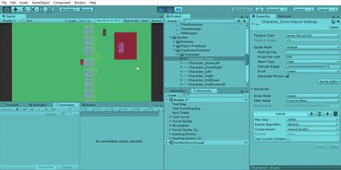
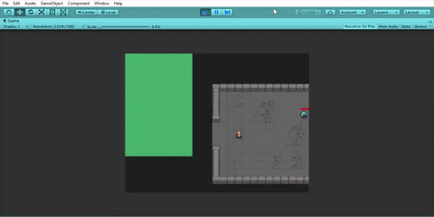
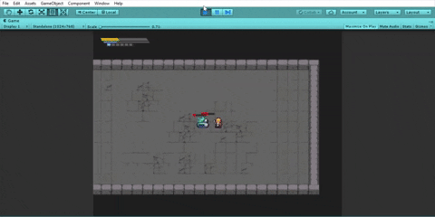
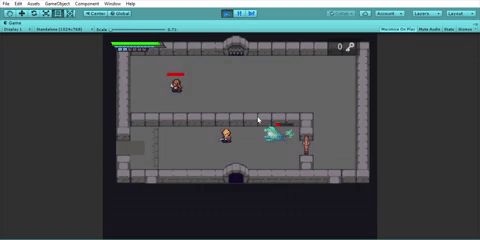

# Project-TimeDash

State of game as of 2018 before overhaul:

## Summer 2019 overhaul:

Premade art assets imported and implemented. Lots of 
features were also removed, like the 8-directional system,
shield, grab, and other player abilities:

Implementation of a health and SP system along with 
UI bars. Also basic Warp attack was implemented (not yet finished)

Implementation of various systems, like room masking,
pit falls, doors, UI prompts

